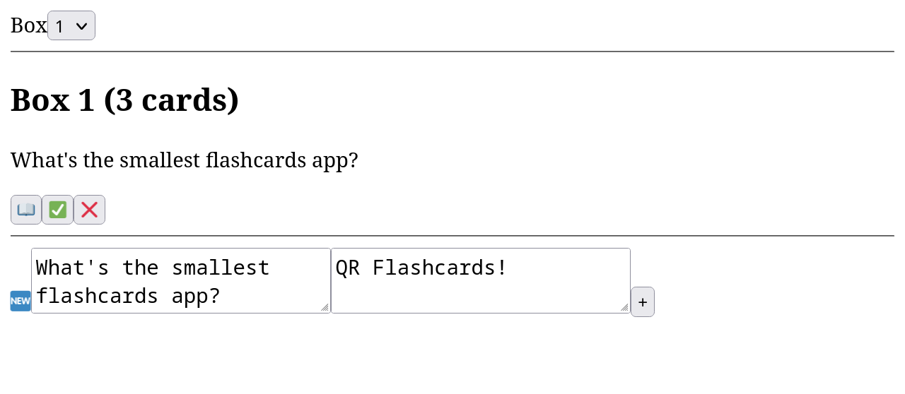

# QR Flashcards

> A tiny (<1KB) Leitner box/flashcards web app

This is a basic flashcards app, that supports the Leitner system, and is built to be small enough that all of its code fits within a single QR code.

As of 2025-01-15, the minified `index.html` file (which contains all the resources needed to run the app) is 969 bytes.

## Usage guide

### Adding flashcards

Start off by adding some flashcards. This can be done in the bottom section of the app (with a 🆕 emoji). Write a question in the first text box, and its answer in the second text box. Then press the "+" button to add your flashcard to the database. This will refresh the page.

You can add flashcards at any time. They are stored in your browser's local storage.

### Switching boxes

Your flashcards are split into 3 boxes, letting you use the Leitner box system ([Wikipedia](https://en.wikipedia.org/wiki/Leitner_system)). New flashcards start in box 1, and move up a box when you answer them correctly. If you answer a flashcard incorrectly, it moves all the way back to box 1.

Pick a box to study using the dropdown in the top section of the app, labelled "Box".

Following the Leitner system, it's recommended that you go through the flashcards in box 1 frequently, box 2 less frequently, and box 3 even less frequently.

### Using the flashcards

The middle section of the app is where you view flashcards, one at a time. The box you're studying is displayed in a heading, and below that, the question of the current flashcard (imagine it being at the top of a pile). Instructions for using the flashcards:

1. Read the question and try to think of the answer
2. Press the book emoji button (📖) to show the answer
   - The question text is replaced by the answer text
3. If you knew the answer and got it correct, press the checkmark button (✅)
   - The flashcard is moved up a box
4. If you didn't know the answer or got it wrong, press the red X button (❌)
   - The flashcard is moved all the way back to box 1
5. After clicking on the checkmark or X button, the next flashcard in the box is shown

#### At the end of a box

If you've gone through all of the flashcards in a box and emptied it out, an "End of box" popup will show. You can either press "OK" to refresh the page to study another box, or press "Cancel" to keep the empty box selected, after which you can either manually select another box, or finish studying.

## Screenshots

## Features of the code

Here's some of the fun features of this code, all done in the name of minimising bytes:

- 🎉 Global variables!
  - `window.b()` my beloved
- 🎉 Impure functions!
  - May or may not have made debugging a pain...
- 🎉 A variable called `$`!
  - You can think of it like jQuery, but without the jQuery
